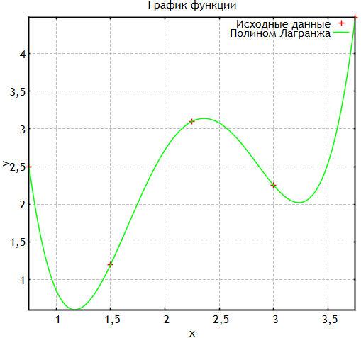
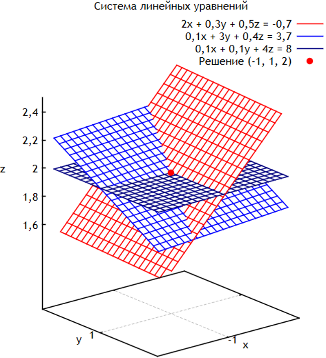

# gnuplot-hpp

Заголовочный файл, реализующий интерфейс для изображения графиков с помощью `gnuplot` в консольном приложении `cpp`.

## Установка

### Windows

Загрузите gnuplot по [ссылке](https://sourceforge.net/projects/gnuplot/files/gnuplot/). Нажмите на кнопку "Download Latest Version" и скачайте файл с расширением `.exe`.

Запустите установщик и в ходе конфигурации установки выберите флажок *Add application directory to your PATH environment variable* для автоматического добавления пути к gnuplot.exe в переменную среды PATH.

### Linux

Ввести в менеджере пакетов следующие команды для установки gnuplot:

    # Debian, Ubuntu, Linux Mint
    sudo apt-get install gnuplot
    
    # Arch, Manjaro
    sudo pacman -Syu gnuplot
    
    # Fedora
    sudo dns install gnuplot

### Mac OS X

Предпочтительным способом установки gnuplot является использование [Homebrew](https://formulae.brew.sh/formula/gnuplot) из терминала:

    brew install gnuplot

### Установка `gnuplot.hpp`

Скачайте файл [gnuplot.hpp](https://github.com/LeoKhariton/gnuplot-hpp/blob/master/gnuplot.hpp) из этого репозитория и сохраните его в каталоге с проектом.

### Основные функции библиотеки

| № | Сигнатура | Назначение | Параметры | Возвращает |
| :---: | --- | --- | --- | --- |
| 1 | `void plot_dot(const std::vector<T>& point)` | Рисует точку на графике | `point` – массив координат точки | – |
| 2 | `void plot3d(const std::string& func, const std::string& label = "", bool use_color_gradient = false)` | Строит трёхмерный график заданной функции | `func` – уравнение,<br>`label` – подпись уравнения,<br>`use_color_gradient` – | – |
| 3 | `void plot3d(const std::vector<T>& x, const std::vector<U>& y, const std::vector<U>& z, const std::string& label = "", LineStyle style = LineStyle::LINES)` | Строит трехмерный график по заданным координатам | `x, y, z` – массивы координат,<br>`label` – подпись,<br>`style` – тип линии | – |
| 4 | `void plot(const std::vector<T>& x, const std::vector<U>& y, const std::string& label = "", LineStyle style = LineStyle::LINES)` | Строит двумерный график по заданным координатам | `x, y` – массивы координат,<br>`label` – подпись,<br>`style` – тип линии | – |
| 5 | `void plot_xerr(const std::vector<T>& x, const std::vector<U>& y, const std::vector<V>& err, const std::string& label = "")` | Строит двумерный график с погрешностями по оси X | `x, y` – массивы координат,<br>`err` – массив соответствующих погрешностей по оси X,<br>`label` – подпись | – |
| 6 | `void plot_yerr(const std::vector<T>& x, const std::vector<U>& y, const std::vector<V>& err, const std::string& label = "")` | Строит двумерный график с погрешностями по оси Y | `x, y` – массивы координат,<br>`err` – массив соответствующих погрешностей по оси Y,<br>`label` – подпись | – |
| 7 | `void plot_xyerr(const std::vector<T>& x, const std::vector<U>& y, const std::vector<V>& xerr, const std::vector<W>& yerr, const std::string& label = "")` | Строит двумерный график с погрешностями по осям X и Y | `x, y` – массивы координат,<br>`xerr` – массив соответствующих погрешностей по оси X,<br>`yerr` – массив соответствующих погрешностей по оси Y,<br>`label` – подпись | – |
| 8 | `void plot_vectors(const std::vector<T>& x, const std::vector<U>& y, const std::vector<V>& vx, const std::vector<W>& vy, const std::string& label = "")` | Строит векторное поле в двумерном пространстве | Принимает векторы координат `x` и `y`, векторы компонент векторов `vx` и `vy` и необязательный заголовок для графика | – |
| 9 | `void histogram(const std::vector<T>& values, size_t nbins, const std::string& label = "", LineStyle style = LineStyle::BOXES)` | Строит гистограмму | Принимает вектор значений, количество интервалов для гистограммы, необязательный заголовок для графика и стиль линии | – |
| 10 | `bool multiplot(int nrows, int ncols, const std::string& title = "")` | Устанавливает режим для отображения нескольких графиков на одном рисунке (окне) в виде сетки | `nrows` – количество строк,<br>`ncols` – количество столбцов,<br>`title` – название графика | `true`, если команда успешно отправлена в Gnuplot, `false` в противном случае |
| 11 | `bool show(bool call_reset = true)` | Отображает все добавленные графики, отправляет команды в Gnuplot | `call_reset` – нужно ли сбросить данные после отображения  | `true`, если команда успешно отправлена в Gnuplot, `false` в противном случае |
| 12 | `bool save_as_png(const std::string& filename, const std::string& size = "800, 600")` | Сохраняет график в файл формата PNG | `filename` – имя файла,<br>`size` – размер изображения в пикселях | `true`, если команда успешно отправлена в Gnuplot, `false` в противном случае |
| 13 | `bool save_as_svg(const std::string& filename, const std::string& size = "800, 600")` | Сохраняет график в файл формата SVG | `filename` – имя файла,<br>`size` – размер изображения в пикселях | `true`, если команда успешно отправлена в Gnuplot, `false` в противном случае |
| 14 | `bool set_title(const std::string& title)` | Устанавливает заголовок графика | `title` – заголовок графика | `true`, если команда успешно отправлена в Gnuplot, `false` в противном случае |
| 15 | `bool set_xlabel(const std::string& label)` | Устанавливает заголовок оси X | `label` – заголовок оси X | `true`, если команда успешно отправлена в Gnuplot, `false` в противном случае |
| 16 | `bool set_ylabel(const std::string& label)` | Устанавливает заголовок оси Y | `label` – заголовок оси Y | `true`, если команда успешно отправлена в Gnuplot, `false` в противном случае |
| 17 | `bool set_zlabel(const std::string& label)` | Устанавливает заголовок оси Z | `label` – заголовок оси Z | `true`, если команда успешно отправлена в Gnuplot, `false` в противном случае |
| 18 | `void set_xrange(double min = NAN, double max = NAN)` | Устанавливает диапазон значений для оси X | `min, max` – минимальное и максимальное значения для оси X | – |
| 19 | `void set_yrange(double min = NAN, double max = NAN)` | Устанавливает диапазон значений для оси Y | `min, max` – минимальное и максимальное значения для оси Y | – |
| 20 | `void set_zrange(double min = NAN, double max = NAN)` | Устанавливает диапазон значений для оси Z | `min, max` – минимальное и максимальное значения для оси Z | – |
| 21 | `bool set_grid()` | Включает отображение сетки на графике | – | – |


## Примеры

### Изображение графика функции в декартовых координатах

```cpp
#include "gnuplot.hpp"
#include <cmath>
#include <vector>

typedef std::vector<double> vector;

double poly(const vector& coeffs, double x) {
	double result = 0;
	int n = coeffs.size();
	for (int i = 0; i < n; i++)
		result += coeffs[i] * pow(x, n - 1 - i);
	return result;
}

int main() {

	Gnuplot plt{ R"("C:\Program Files\gnuplot\bin\gnuplot.exe")" };

	vector x = { 0.75, 1.5, 2.25, 3, 3.75 };
	vector y = { 2.5, 1.2, 3.1, 2.25, 4.48 };

	vector coeffs = { 1.55127572, -13.98518519, 43.96296296, -55.4, 24.73 };

	std::vector<double> xs, ys;

	for (double i = x[0]; i <= x.back(); i += 0.01) {
		xs.push_back(i);
		ys.push_back(poly(coeffs, i));
	}

	plt.plot(x, y, "Исходные данные", Gnuplot::LineStyle::POINTS);
	plt.plot(xs, ys, "Полином Лагранжа");
	plt.set_title("График функции");
	plt.set_grid();
	plt.set_xlabel("x");
	plt.set_ylabel("y");

	return 0;
}
```


### Визуализация решения линейной системы

```cpp
#include "gnuplot.hpp"

int main() {

	Gnuplot plt { R"("C:\Program Files\gnuplot\bin\gnuplot.exe")" };

	plt.set_title("Система линейных уравнений");

	plt.set_xlabel("x");
	plt.set_ylabel("y");
	plt.set_zlabel("z");

	plt.set_xrange(-3, 1);
	plt.set_yrange(0.5, 1.5);
	plt.set_zrange(1.5, 2.5);

	plt.plot3d("(-0.7-2*x-0.3*y)/0.5", "2x + 0,3y + 0,5z = -0,7");
	plt.plot3d("(3.7-0.1*x-3*y)/0.4", "0,1x + 3y + 0,4z = 3,7");
	plt.plot3d("(8-0.1*x-0.1*y)/4", "0,1x + 0,1y + 4z = 8");

	plt.plot_dot({ -1, 1, 2 }, "Решение (-1, 1, 2)");

	plt.set_grid();

	return 0;
}
```
